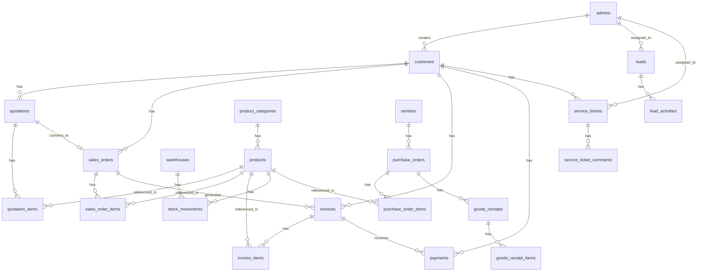

# Database Schema

## Overview

The ALTechnics ERP database consists of 20+ tables organized around core business entities. All major tables use soft deletes and audit columns (`created_by`, `updated_by`, `deleted_by`).

## Entity Relationship Diagram

## Table Reference

### admins

| Column | Type | Description |
|--------|------|-------------|
| id | bigint | Primary key |
| name | varchar(255) | Full name |
| email | varchar(255) | Unique login email |
| password | varchar(255) | Hashed password |
| phone | varchar(50) | Contact phone |
| status | enum(active, inactive) | Account status |
| created_at / updated_at | timestamp | Timestamps |

### customers

| Column | Type | Description |
|--------|------|-------------|
| id | bigint | Primary key |
| code | varchar(20) | Auto-generated customer code |
| name | varchar(255) | Customer name |
| company | varchar(255) | Company name |
| gst_number | varchar(20) | GST identification |
| email | varchar(255) | Email address |
| phone | varchar(50) | Phone number |
| billing_address | text | Billing address |
| shipping_address | text | Shipping address |
| city, state, pincode, country | varchar | Address fields |
| credit_limit | decimal(12,2) | Credit limit |
| notes | text | Internal notes |
| status | enum(active, inactive) | Status |
| created_by, updated_by, deleted_by | bigint | Audit references to admins |

### products

| Column | Type | Description |
|--------|------|-------------|
| id | bigint | Primary key |
| code | varchar(20) | Product code |
| name | varchar(255) | Product name |
| category_id | bigint | FK to product_categories |
| hsn_code | varchar(20) | HSN/SAC code for GST |
| unit | varchar(20) | Unit of measure (pcs, kg, etc.) |
| purchase_price | decimal(12,2) | Cost price |
| selling_price | decimal(12,2) | Default selling price |
| mrp | decimal(12,2) | Maximum retail price |
| tax_percent | decimal(5,2) | GST tax rate |
| reorder_level | int | Low stock threshold |
| description | text | Product description |
| image | varchar(255) | Image file path |
| status | enum(active, inactive) | Status |

### quotations / sales_orders / invoices

These three tables share a similar structure with line items:

| Column | Type | Description |
|--------|------|-------------|
| id | bigint | Primary key |
| number | varchar(20) | Auto-generated document number |
| customer_id | bigint | FK to customers |
| date | date | Document date |
| subtotal | decimal(12,2) | Sum of line items |
| discount_type | enum(flat, percent) | Discount type |
| discount_value | decimal(12,2) | Discount amount/percent |
| tax_percent | decimal(5,2) | Tax rate |
| tax_amount | decimal(12,2) | Computed tax |
| grand_total | decimal(12,2) | Final amount |
| terms, notes | text | Terms and internal notes |

Invoices additionally have: `due_date`, `amount_paid`, `balance_due`, `status` (draft/sent/paid/overdue/cancelled).

### stock_movements

| Column | Type | Description |
|--------|------|-------------|
| id | bigint | Primary key |
| product_id | bigint | FK to products |
| warehouse_id | bigint | FK to warehouses |
| type | enum(in, out, adjustment) | Movement type |
| quantity | decimal(12,2) | Quantity moved |
| reference_type | varchar | Polymorphic reference model |
| reference_id | bigint | Polymorphic reference ID |
| notes | text | Reason/notes |
| created_by | bigint | Who performed |
| created_at | timestamp | When performed |

### Other Tables

- **lead_activities** — Tracks follow-up notes and status changes on leads
- **purchase_order_items** — Line items for purchase orders
- **goods_receipts / goods_receipt_items** — Partial receiving against purchase orders
- **payments** — Payment records linked to invoices
- **service_ticket_comments** — Threaded comments on service tickets
- **settings** — Key-value configuration store (company info, prefixes, currency)
- **permissions / roles** — Spatie permission tables
- **activity_log** — Spatie activity log table
