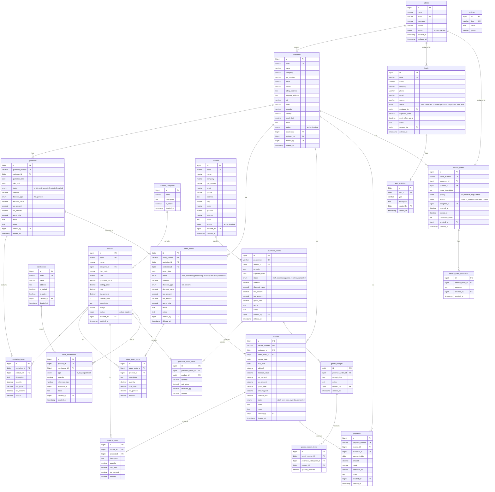

# Entity Relationship Diagram

## ALTechnics ERP Database Schema

```mermaid
erDiagram
    admins {
        bigint id PK
        varchar name
        varchar email UK
        varchar password
        varchar phone
        enum status "active, inactive"
        timestamp created_at
        timestamp updated_at
    }

    customers {
        bigint id PK
        varchar code UK
        varchar name
        varchar company
        varchar gst_number
        varchar email
        varchar phone
        text billing_address
        text shipping_address
        varchar city
        varchar state
        varchar pincode
        varchar country
        decimal credit_limit
        text notes
        enum status "active, inactive"
        bigint created_by FK
        bigint updated_by FK
        bigint deleted_by FK
        timestamp deleted_at
    }

    leads {
        bigint id PK
        varchar code UK
        varchar name
        varchar company
        varchar phone
        varchar email
        varchar source
        enum status "new, contacted, qualified, proposal, negotiation, won, lost"
        bigint assigned_to FK
        decimal expected_value
        datetime next_follow_up_at
        text notes
        bigint created_by FK
        timestamp deleted_at
    }

    lead_activities {
        bigint id PK
        bigint lead_id FK
        varchar type
        text description
        bigint created_by FK
        timestamp created_at
    }

    product_categories {
        bigint id PK
        varchar name
        text description
        boolean is_active
        timestamp deleted_at
    }

    products {
        bigint id PK
        varchar code UK
        varchar name
        bigint category_id FK
        varchar hsn_code
        varchar unit
        decimal purchase_price
        decimal selling_price
        decimal mrp
        decimal tax_percent
        int reorder_level
        text description
        varchar image
        enum status "active, inactive"
        bigint created_by FK
        timestamp deleted_at
    }

    warehouses {
        bigint id PK
        varchar code UK
        varchar name
        text address
        boolean is_default
        boolean is_active
        bigint created_by FK
        timestamp deleted_at
    }

    stock_movements {
        bigint id PK
        bigint product_id FK
        bigint warehouse_id FK
        enum type "in, out, adjustment"
        decimal quantity
        varchar reference_type
        bigint reference_id
        text notes
        bigint created_by FK
        timestamp created_at
    }

    vendors {
        bigint id PK
        varchar code UK
        varchar name
        varchar company
        varchar gst_number
        varchar email
        varchar phone
        text address
        varchar city
        varchar state
        varchar pincode
        varchar country
        text notes
        enum status "active, inactive"
        bigint created_by FK
        timestamp deleted_at
    }

    quotations {
        bigint id PK
        varchar quotation_number UK
        bigint customer_id FK
        date quotation_date
        date valid_until
        enum status "draft, sent, accepted, rejected, expired"
        decimal subtotal
        enum discount_type "flat, percent"
        decimal discount_value
        decimal tax_percent
        decimal tax_amount
        decimal grand_total
        text terms
        text notes
        bigint created_by FK
        timestamp deleted_at
    }

    quotation_items {
        bigint id PK
        bigint quotation_id FK
        bigint product_id FK
        text description
        decimal quantity
        decimal unit_price
        decimal tax_percent
        decimal amount
    }

    sales_orders {
        bigint id PK
        varchar order_number UK
        bigint quotation_id FK
        bigint customer_id FK
        date order_date
        enum status "draft, confirmed, processing, shipped, delivered, cancelled"
        decimal subtotal
        enum discount_type "flat, percent"
        decimal discount_value
        decimal tax_percent
        decimal tax_amount
        decimal grand_total
        text terms
        text notes
        bigint created_by FK
        timestamp deleted_at
    }

    sales_order_items {
        bigint id PK
        bigint sales_order_id FK
        bigint product_id FK
        text description
        decimal quantity
        decimal unit_price
        decimal tax_percent
        decimal amount
    }

    purchase_orders {
        bigint id PK
        varchar po_number UK
        bigint vendor_id FK
        date po_date
        date expected_date
        enum status "draft, confirmed, partial, received, cancelled"
        decimal subtotal
        decimal discount_value
        decimal tax_percent
        decimal tax_amount
        decimal grand_total
        text terms
        text notes
        bigint created_by FK
        timestamp deleted_at
    }

    purchase_order_items {
        bigint id PK
        bigint purchase_order_id FK
        bigint product_id FK
        decimal quantity
        decimal unit_price
        decimal received_qty
        decimal amount
    }

    goods_receipts {
        bigint id PK
        bigint purchase_order_id FK
        date receipt_date
        text notes
        bigint created_by FK
        timestamp created_at
    }

    goods_receipt_items {
        bigint id PK
        bigint goods_receipt_id FK
        bigint purchase_order_item_id FK
        bigint product_id FK
        decimal quantity_received
    }

    invoices {
        bigint id PK
        varchar invoice_number UK
        bigint customer_id FK
        bigint sales_order_id FK
        date invoice_date
        date due_date
        decimal subtotal
        decimal discount_value
        decimal tax_percent
        decimal tax_amount
        decimal grand_total
        decimal amount_paid
        decimal balance_due
        enum status "draft, sent, paid, overdue, cancelled"
        text terms
        text notes
        bigint created_by FK
        timestamp deleted_at
    }

    invoice_items {
        bigint id PK
        bigint invoice_id FK
        bigint product_id FK
        text description
        decimal quantity
        decimal unit_price
        decimal tax_percent
        decimal amount
    }

    payments {
        bigint id PK
        varchar payment_number UK
        bigint invoice_id FK
        bigint customer_id FK
        date payment_date
        decimal amount
        varchar mode
        varchar reference_no
        text notes
        bigint created_by FK
        timestamp deleted_at
    }

    service_tickets {
        bigint id PK
        varchar ticket_number UK
        bigint customer_id FK
        bigint product_id FK
        text issue_description
        enum priority "low, medium, high, critical"
        enum status "open, in_progress, resolved, closed"
        bigint assigned_to FK
        datetime opened_at
        datetime closed_at
        text resolution_notes
        bigint created_by FK
        timestamp deleted_at
    }

    service_ticket_comments {
        bigint id PK
        bigint service_ticket_id FK
        text comment
        bigint created_by FK
        timestamp created_at
    }

    settings {
        bigint id PK
        varchar key UK
        text value
        varchar group
    }

    admins ||--o{ customers : "creates"
    admins ||--o{ leads : "assigned_to"
    admins ||--o{ service_tickets : "assigned_to"
    customers ||--o{ quotations : "has"
    customers ||--o{ sales_orders : "has"
    customers ||--o{ invoices : "has"
    customers ||--o{ payments : "has"
    customers ||--o{ service_tickets : "has"
    quotations ||--o{ quotation_items : "contains"
    quotations ||--o| sales_orders : "converts_to"
    sales_orders ||--o{ sales_order_items : "contains"
    sales_orders ||--o{ invoices : "generates"
    invoices ||--o{ invoice_items : "contains"
    invoices ||--o{ payments : "receives"
    product_categories ||--o{ products : "contains"
    products ||--o{ quotation_items : "in"
    products ||--o{ sales_order_items : "in"
    products ||--o{ invoice_items : "in"
    products ||--o{ purchase_order_items : "in"
    products ||--o{ stock_movements : "tracks"
    warehouses ||--o{ stock_movements : "stores"
    vendors ||--o{ purchase_orders : "supplies"
    purchase_orders ||--o{ purchase_order_items : "contains"
    purchase_orders ||--o{ goods_receipts : "receives"
    goods_receipts ||--o{ goods_receipt_items : "contains"
    leads ||--o{ lead_activities : "logs"
    service_tickets ||--o{ service_ticket_comments : "has"
```
